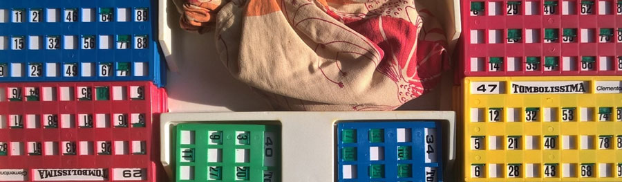

# Tombola Studio

###
By Harry G. Potter (harry[dot]g[dot]potter[at]gmail[dot]com)
This file has been written on October 31st, 2019.
Revision 1.0.001
###

**TombolaSudio** is a personal, software _pet project_ I'm working on since many years, just in spare time.
As of now, it consists of a tiny Java library, some command line tools and a classical web application, all of them aimed to support the famous Italian game of [**_Tombola_**](https://en.wikipedia.org/wiki/Tombola_(raffle)). The code, as usual, is always under construction and several bugs are here and there, but finally, in a sunny day of June 2020, I decided to publish all my stuffs on GitHub and see if in the world there is someone else that want to play on these stuffs.

Here are the goals of **TombolaStudio**:
* Support the **generation of small & large sets of Tombola cards**, that is the classical matrixes of 3 rows by 9 columns filled with 15 numbers between 1 and 90 and 12 empty cells.
* Help to **print on paper these Tombola cards**, so that large groups of people can enjoy crowded, noisy and amazing matches.
* _**Digitally assist**_ engaging Tombola matches, with tens or even hundreds of particpants and playing cards.

Here a brief description follows for each developed software components. Each of them is in a dedicated subfolder of this TombolaStudio repository, where you can find also a dedicated and more detailed README.MD file.

## [TombolaCards](./TombolaCards)
This tool mainly let you *generate lists of series of Tombola cards* trying to improve their "game-ability", that is trying to avoid cards too similar between them and therefore reducing the probability of concurrent-wins during a Tombola match. You will also be able to save these lists of series of cards on a text files, re-elaborate them, and so on. TombolaCards is a command line tool and can be used both as a pure _one shot run_ with parameters and option specified when launching the program as well as in interactive mode. TombolaCards: your Swiss Army knife to create and manage all your tombola cards!

## [TombolaPrint](./TombolaPrint)
Once created, you will need to print your cards on paper. TombolaPrint is another command line tool helping you to convert a csv file prepared by TombolaCards into a pretty formatted HTML+CSS file, ready to be really printed using your preferred browser

## [TombolaWeb](./TombolaWeb)
COMING SOON... but you really will love it!

## [TombolaLib](./TombolaLib)
**TombolaLib** is the _home made_ Java class library realized to support the 
development of the “end user ready” software tools described above. It contains classes and methods to generate well formed cards, collecting them in sets, saving to and loading from files and databases, printing them. It also contains code to digitally simulate Tombola games, checking hunderds of cards in real time, find curiosity and fun facts, etc.
 
## Getting Started

### Prerequisites 
To play with this software you need:
* A common PC where you can run [Java](https://www.oracle.com/java/) programs. I'am on a Windows notebook right now, but everything here should run also on Linux, MacOS, ...
* A recent [Java Development Kit](https://www.oracle.com/technetwork/java/javase/overview/index.html) installed on your machine. I'm using the Open Java JDK 12.0, but all TombolaStudio code should work with any JDK since version 1.8. Please, assure to have a JAVA_HOME environment variable properly set.
* (_optional_) The [Apache Maven](https://maven.apache.org/) tool to manage source code, software builds, etc. I'm using Apache Maven 3.6.1 right now.

Here follows what happens on my machine when I run the java -version command:

```
c:\>java -version
java version "1.8.0_221"
Java(TM) SE Runtime Environment (build 1.8.0_221-b11)
Java HotSpot(TM) 64-Bit Server VM (build 25.221-b11, mixed mode)
```
And here follows the output of the mvn -version command on my pc:
```
c:\>mvn -version
Apache Maven 3.6.1 (d66c9c0b3152b2e69ee9bac180bb8fcc8e6af555; 2019-04-04T21:00:29+02:00)
Maven home: C:\dev\run\apache-maven-3.6.1\bin\..
OS name: "windows 7", version: "6.1", arch: "amd64", family: "windows"
```

As stated above, each component has its own readme file with specific instruction to get started, anyway, if you're already familiar with Maven, here in `/TombolaStudio` there is a master `pom.xml` file that, if launched, will compile and prepare all its _children_ project. Try `mvn package` directly from here.

## What's next?
Oh... this is a big work in progress! Currently I'm working on *TombolaWeb*, the most exciting component of this whole toolset. Please stay tuned and come back here once in a while.

## How to contribute
I haven't set a contribution policy yet, but... the code is here on GitHub and I'll be very happy to receive suggestions, comments, corrections, pull requests... thank you very much since now!

## Authors
* **Harry G. Potter** - _harry[dot]g[dot]potter[at]gmail[dot]com_

## License
This project is licensed under the GNU GENERAL PUBLIC LICENSE - see the [LICENSE](LICENSE) file for details

## Acknowledgments
* Hat tip to my brother, **"The Doc"**, for his original algorithm, many ideas and his inspiration ( `if(stessaDecina())` made the history! ).
